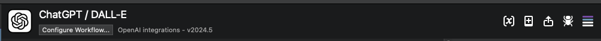

#  ChatGPT / DALL-E Alfred Workflow

OpenAI integrations

[⤓ Install on the Alfred Gallery](https://alfred.app/workflows/alfredapp/openai)

## Setup

1. Create an OpenAI account and [log in](https://platform.openai.com/login?launch).
2. On the [API keys page](https://platform.openai.com/api-keys), click `+ Create new secret key`.
3. Name your new secret key and click `Create secret key`.
4. Copy your secret key and add it to the [Workflow’s Configuration](https://www.alfredapp.com/help/workflows/user-configuration/).
   - If you are using a custom base url, set the `chatgpt_api_endpoint`environment variable in the top right corner of the alfred workflow UI.

**Hot tip:** Using earlier models (e.g. ChatGPT 3.5 and DALL·E 2) is the most cost-effective way to use these OpenAI tools and stretch your credit a long way!

## Usage

Query ChatGPT via the `chatgpt` keyword.

* <kbd>↩&#xFE0E;</kbd> Ask a new question.
* <kbd>⌘</kbd><kbd>↩&#xFE0E;</kbd> Clear and restart chat.
* <kbd>⌥</kbd><kbd>↩&#xFE0E;</kbd> Copy last answer.
* <kbd>⌃</kbd><kbd>↩&#xFE0E;</kbd> Copy full chat.
* <kbd>⇧</kbd><kbd>↩&#xFE0E;</kbd> Stop generating answer.

Query DALL·E via the `dalle` keyword.

* <kbd>↩&#xFE0E;</kbd> Send a new prompt.
* <kbd>⌥</kbd><kbd>↩&#xFE0E;</kbd> Reveal the most recent image in the Finder.
